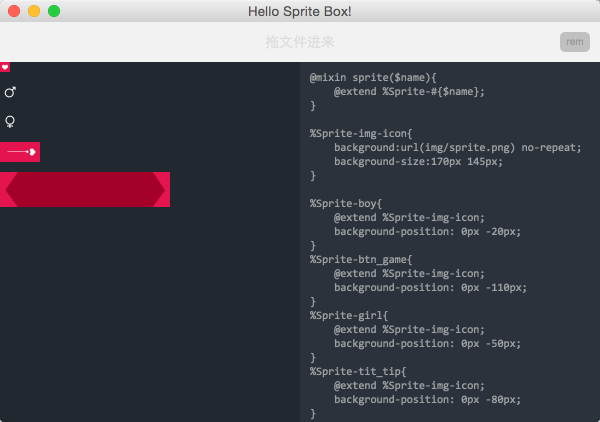

#nw sprite box
====
一个 node-webkit 的雪碧图 合并器

###目录结构

	+spriteBox
		+app  //这里是我的代码
		nwjs.app //nw 的文件需要去nw 上下载
		package.json
		README.md

###配置
需要npm一下，下载组件。

	cd app
	npm install
	
###使用方法
运行nwjs.app 

把需要合并的图片拖入即可

Sass 引用代码

	@include sprite('icon-name') //icon-name 就是icon名称

###截图

	
